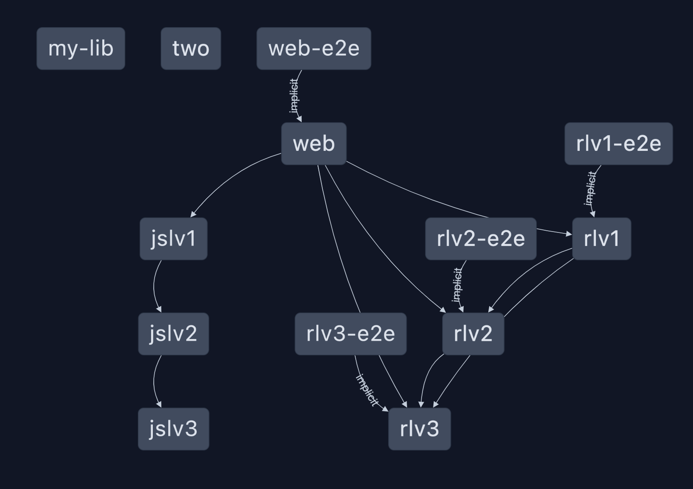

# `nxViteTsPaths` plugin test

This branch contains a test for the `nxViteTsPaths` plugin.

## How to run

```bash
npx nx run-many --target=build-storybook --skipNxCache
```

and

```bash
npx nx run-many --target=build --skipNxCache
```

And all work!

Here's a screenshot of `nx graph` to show all the dependencies and the paths expected to be found:

